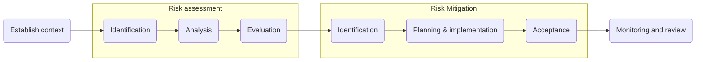

## Background

Risk management of managed artifacts is the backbone of the ISMS. Though it is defined separately here, day-to-day it is carried out as part of the software development lifecycle described in the [software-development-lifecycle-policy].

## Objectives

- Define an approach to risk assessment and risk mitigation
- Define an approach to ongoing monitoring

## Scope

All risk management activities on managed artifacts (see the [managed-artifact-register]).

## Definitions

- **Risk** - risks are composed of an artifact, threat and vulnerability and are defined in a standard format: `<A threat>` exploits `<a vulnerability>` resulting in `<a consequence for an artifact>`
  - **Threat** - potential cause of an unwanted incident, which may result in harm to a system or organisation.
  - **Vulnerability** - weakness of an artifact or control that can be exploited by one or more threats.
  - **Artifact** - a digital or physical object that stores information and has a value (see [artifact-management-policy]). Often also known as an *asset*.
  - **Consequence** - (usually negative) outcome for an artifact of a threat exploiting a vulnerability.

- **Impact Level** - the impact of a risk, were it to occur, on the confidentiality (C), integrity (I) and availability (A) of the artifact under threat. It is assigned using these definitions:

| Level | Definition |
| :- | :- |
| High | Serious violation of legal, regulatory or contractual obligations that results in a penalty or fine, considerable economic loss that cannot be restored, or serious loss of reputation that is devastating for trust |
| Medium | Less serious violation of law that results in a warning or a command, economic loss that can be restored, or reduction of reputation that may influence trust |
| Low | No violation of law, small economic loss that can be restored or small reduction of reputation that may influence trust in the short term |

- **Likelihood level** - the likelihood of a risk occurring. It is assigned using these definitions:

| Level | Frequency | Ease of misuse and motivation |
| :- | :- | :- |
| High | Often. Occurs 1-10% of the time (>4x a year) | Can be done without/with minor knowledge about the system or it can be performed by wrong or careless usage |
| Medium | May happen. Occurs 0.25-1% of the time (1-4x a year) | Normal knowledge about the system is sufficient or it can be performed deliberately |
| Low | Rare. Occurs between <0.25% of the time (<1x a year) | Detailed knowledge about the system is needed or it can be performed only deliberately and with the help of internal personnel |

- **Risk level** - Risk level is set using a qualitative scale (Low, Medium, High) and assigned based on output of the Risk Model. Where there are differing impact levels for C, I and A, risk level is estimated using the highest impact level.

- **Risk model** - Model that assigns a risk level given impact and likelihood levels.

|  | Impact L | Impact M | Impact H |
| :- | :- | :- | :- | :- |
| **Likelihood H** | Medium | High | High |
| **Likelihood M** | Low | Low | High |
| **Likelihood L** | Low | Low | Medium |

- **Risk acceptance** - Evaluation of whether to accept a risk with the following rules:

| Level | Definition |
| :- | :- |
| High | Unacceptable risk. Controls must be implemented. |
| Medium | Unacceptable risk. Controls must be implemented. Acceptance is justified in cases where there are no viable mitigations. |
| Low | Acceptable risk. Risks must be monitored to detect increase in level. |

- **Control** - a measure designed to reduce the risk level of one or more risks.

## Flow chart

## Policy

Risk management has two parts - risk assessment and risk mitigation. Both of these happen as part of our daily routine as described in the [software-development-lifecycle-policy] and make use of the [risk-management-procedure].

### Risk assessment
<Link to="iso27001/6.1.2, iso27001/8.2" kind="implements" />

#### Context

Ensure any risk identified is relevant to the organisation's interested parties and their requirements (see [interested-parties-record]).

#### Identification

Use the example risks in the [risk-register] to help you identify relevant risks during assessment.

Risks are assigned owners, usually the Privacy or Security Officer or a senior member of staff.

Risks are documented in the [risk-register].

#### Analysis

Analysis involves impact assessment, likelihood assessment and risk level estimation using the definitions above.

A prerequisite for impact assessment is valuing the artifact under threat. We estimate artifact value by using a qualitative scale (Low, Medium, High) and assigning a value based on losses incurred due to a loss of CIA.

Artifact values are recorded in the [managed-artifact-register].

Impacts assigned are determined largely by the value of the artifacts under threat. Likelihoods are subjectively assigned based on known evidence and past experience.

The overall risk level is determined by the risk model based on these inputs. This is the inherent risk level.

#### Evaluation

We evaluate the priority of risks for mitigation based on risk level - the higher the level, the higher the priority.

Prioritised risks are evaluated against the risk acceptance criteria. If a risk exceeds the tolerance threshold, mitigation is required; if not, the risk may be accepted.

On occasion, risks below the tolerance threshold may still require mitigation - this is determined by the Security and Privacy Officers.

### Risk mitigation
<Link to="iso27001/6.1.3, iso27001/8.3" kind="implements" />

#### Identification

The starting point we use for mitigations is the mitigations in the [risk-register].

If necessary, adapt or add new controls.

#### Planning & implementation

Controls are analysed, evaluated, planned and implemented as part of the team's regular planning activities described in the [software-development-lifecycle-policy].

#### Risk acceptance

Residual risks are accepted when they are below the tolerance threshold specified in the risk acceptance criteria.

In cases where residual risk exceeds this threshold, further control selection may be necessary.

If, after further mitigation, residual risk still exceeds the tolerance threshold, it is at the discretion of the Security and Privacy Officers to accept the risk, or not.

### Review
<Link to="iso27001/6.1.1, iso27001/8.3" kind="implements" />

Measurement and monitoring of every control implemented would be impractical.

Top risks and mitigations shall be reviewed in line with the [management-review-procedure].

The risk register shall be reviewed in full at least annually.

#### Metrics

The Security Officer shall create metrics covering areas of (potential) highest risk to the organisation.

Appropriate data collection, storage, verification and analysis tools shall be identified by the Security Office and reviewed at least annually.

The Security Officer shall define procedures for how these tools are used. Where possible, tools should form part of automated processes with as few manual steps as possible.

#### Monitoring

Metrics shall be implemented as part of the team's regular cadence.

Employees responsible for implementation shall test metrics to ensure they are accurate, repeatable and consistent.

Metrics shall be assessed and evaluated periodically, and further actions identified where necessary.
