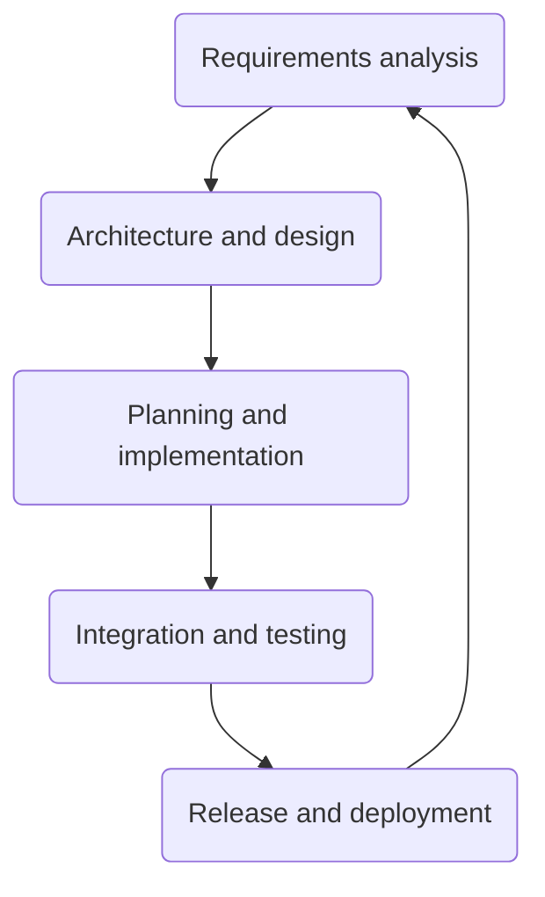
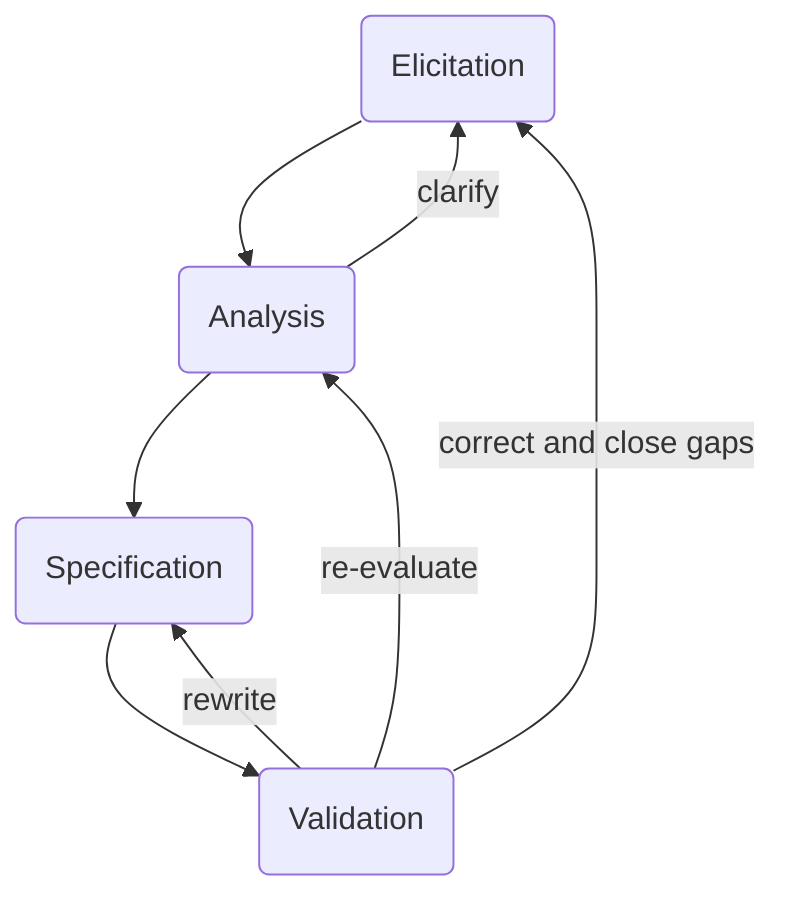
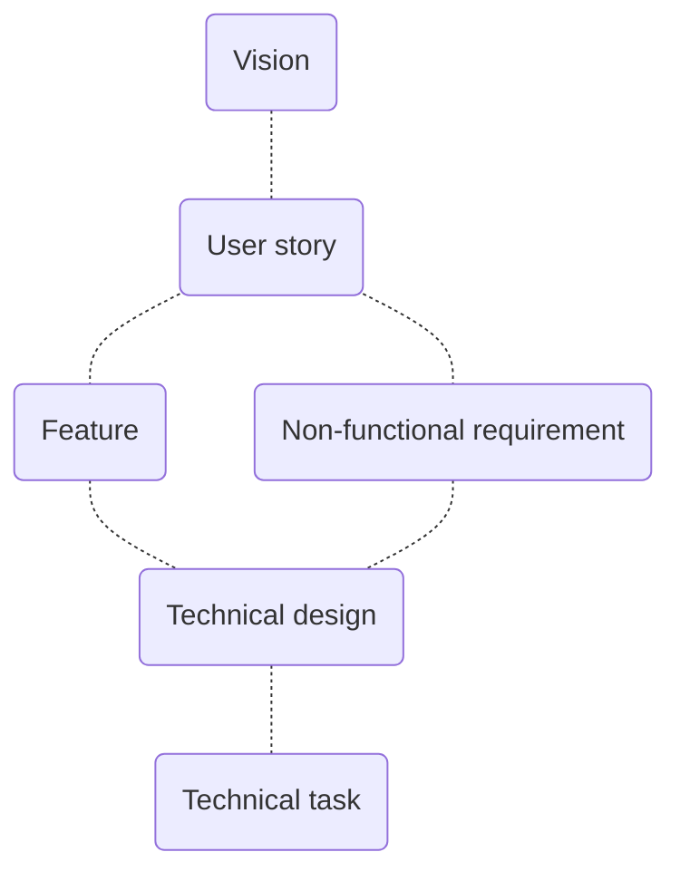

## Background

The software development lifecycle (SDLC) describes the process we use to develop and deliver software to users.

## Objectives

- Define each stage of the SDLC and its activities
- Define methodologies and roles
- Outline how security is addressed throughout

## Scope

All software development activities.

## Definitions

- **Release** - release candidate tag that has been tested and is ready to be deployed to production.
  - **Release branch** - a branch of code that is selected for release but not yet "signed off".
  - **Release candidate** - a tag on a release branch, which is verified but needs testing and validating.

## Policy
<Link artifactId="iso27001/A.12.1.2" kind="implements" />

### Software development lifecycle (SDLC)

The SDLC consists of the following activities:

### Requirements analysis

The requirements analysis process is summarised in this diagram:

It consists of the following activities:
- **Elicitation** - Drawing requirements out of users and stakeholders using a variety of techniques including user testing, lab testing, interviews and usage data gathered via analytics services.
- **Analysis** - Understanding the underlying problems to be solved, refining user and stakeholder requirements, and combining this with system requirements
- **Specification** - Formulating requirements using an appropriate hierarchy and format, and documenting them. See figure X for the hierarchy we use.  
- **Validation** - Verifying requirements are as accurate as they can be given the evidence, and can be verified as being done once implemented via acceptance criteria and test cases.

This process yields specified requirements captured at different levels of abstraction:

Each level has accompanying templates that allow the team to document requirements using an agreed format (see [sdlc-templates]).

It is not necessary to fully populate this hierarchy top-down. Rather it is intended as a guide to help the team document as much as they need in order to deliver value to users and the business.

### Architecture and design

#### Architecture

TODO

#### Design

TODO

### Planning and implementation

#### Methodologies

Development methodologies used include agile methods Scrum and Kanban.

The choice of which agile method to use depends on the development project as well as the stage of its development. Generally the following guidance should be used:
- **Scrum** - the work has defined goals and/or a deadline and/or fixed budget. Scrum provides a structured method for Product Owners to adjust the scope of work as the project progresses, as it is the only variable that can change (budget and/or time are fixed).
- **Kanban** - the work stream is continuous and has no end (e.g. service support). Work is prioritised and ranked, where the highest ranked work is done first. When a blocker is identified, all other work stops until the block is cleared. Kanban has no defined goals, roles or cadence, only rank or priority.
- **Scrumban** - this is a hybrid of Scrum and Kanban where goals are defined and a fixed cadence is used, however work is done in rank (priority) order. Before starting, the ranking method must be agreed, as well as the goals for the period. A showcase occurs at defined intervals, as well as regular ranking exercises to refine the backlog.

#### Roles

The following software development roles exist:
- **Architects** - The Architecture Group oversees the architecture of the software being developed in line with the practices governed by this policy. Any changes and decisions related to those projects are approved or rejected by this group.
- **Product Owners** - Product Owners are responsible for working with key stakeholders to gather and prioritise work for the engineering team. They hold the vision for the product and make the final decision on what features the product will have.
- **Scrum Masters** - Scrum Masters work with the Engineers and Product Owners to ensure the values of Scrum are embedded into team processes and ways of working. They help remove impediments and facilitate meetings.
- **Developers** - Engineers deliver the work defined by the Product Owner. They estimate and decide how best to deliver the work and support the Senior Engineers.
- **Senior Developers** - Senior Engineers deliver work defined by the Product Owner alongside the Engineers and work with the CTO to define and implement the technical design and architecture of software.
- **UX Designers** - UX engineers are responsible for ensuring the software is optimised for users so that it is effective, accessible and easy to use.
- **Quality Assurance (QAs)** - QA Engineers ensure the work delivered by the Engineers meets the acceptance criteria defined by the Product Owner through a series of manual, automated and regression tests.

##### Outsourced development
<Link artifactId="iso27001/A.14.2.7" kind="implements" />

Agency and individual contract developers are used on many projects.

External developers are subject to this policy and the [software-development-lifecycle-procedure], as well as controls described in the [supplier-relationships-policy].

#### Meetings

- **Daily stand up** - A short daily meeting at the start of the day where any impediments are highlighted. Each team member will provide a very short update. Participants must stand to keep the meeting short.
- **Sprint planning** - A meeting held at the start of sprints (occurs two-weekly when in regular sprints) where the scope of the sprint is agreed by prioritising and selecting stories that are ready for development. The engineers establish agree a contract with the Product Owner to deliver functionality in the sprint by setting what will be demonstrated at the sprint showcase.
- **Backlog refinement** - A meet held one week after the sprint planning meeting that is used to prioritise the backlog, measure stories waiting for development against the Definition of Ready, to refine stories further and if time allows, write new stories.
- **Mid-sprint review** - A review held one week after the start of the sprint starts to review the progress so far and if the sprint goal will be met and the showcase successful. This is an opportunity for the Engineers and Product Owner to adjust the scope of the sprint.
- **Sprint showcase** - A demonstration of work completed during the sprint. The agenda of the showcase was set during sprint planning.
- **Sprint retrospective** - At the end of the sprint, the team will come together to reflect on the progress made in the sprint. A structured review should be performed (e.g. Good, Bad, Continue, Stop) and actions resulting from the retrospective should be recorded in the RAID log.

Meeting agendas can be found in the [software-development-lifecycle-procedure].

#### Source code
<Link artifactId="iso27001/A.14.2.2, iso27001/A.14.2.4" kind="implements" />

Source code is stored in [Git](https://git-scm.com/), a distributed version control system that provides version control, change control and tools for collaboration.

The team uses a branching strategy based on [Gitflow](https://nvie.com/posts/a-successful-git-branching-model/) utilising `feature`, `develop`, `release`, `hot fix` and `master` branches.

Developers should create feature branches off an up-to-date `develop` branch, and commit changes to a feature branch in source control locally, before pushing to remote to share with the team  e.g. for review.

Once a unit of work is ready, the author should create a Pull Request for the relevant feature branch, which should be reviewed by appropriate team members before being merged into `develop`.

#### Environments
<Link artifactId="iso27001/A.12.1.4" kind="implements" />

We use development, staging and production environments. Each of these must be separated logically.

Separate cloud provider accounts must be used for production workloads. Access to these environments should be kept to a minimum number of people in line with the [access-control-policy].

All development tools are accessible only within the development environment.

TODO: any more relevant info from POV of SDLC policy.

#### Review and management

- **Quarterly retrospective** - Every quarter we will come together to reflect on progress that quarter, measured by the OKRs agreed at the start of the quarter. OKRs for the next quarter should be considered and
- **Annual retrospective** - Similar to the mid-year review, with the addition of reflecting on progress during that year by evaluating our progress against annual OKRs. New annual and quarterly OKRs for the following year will be set.

### Integration and testing

#### Continuous integration
TODO

#### Tests

- **Unit tests** - TODO
- **Integration tests** - TODO
- **End-to-end tests** - TODO
- **Manual testing** - TODO

#### Test Data
<Link artifactId="iso27001/A.14.3.1" kind="implements" />

Test data used for development must not contain Personal Data (see [information-classification-procedure])

Occasionally, test data that is either representative of production, or actual production data, will be required for system acceptance testing and verification. This test data must be handled in line with the [artifact-management-policy] and be stored and processed in an environment appropriate for its information classification.

### Release and deployment
<Link artifactId="iso27001/A.12.1.3" kind="implements" />

- **Release** - When a product increment is ready for release, it needs to be grouped together into a release candidate and checked for readiness using the [release-checklist]. A release candidate branch should be created and peer reviewed. Once accepted, the branch should be merged into the master branch and tagged. If rejected, any useful changes should be merged back into the development branch.
- **Deployment** - When a release has been reviewed and approved, it is scheduled for deployment and then deployed to production.

Cloud infrastructure required for the deployment is estimated using projected user numbers, concurrency of use and intensity of usage. Infastructure capacity is adjusted continuously based on actual usage patterns.

TODO *more detail*

### Security
<Link artifactId="iso27001/6.1.1, iso27001/8.1, iso27001/A.6.1.5," kind="implements" />

Security work happens throughout the SDLC: The following diagram highlights the key places it takes place:

<!-- https://blogs.grammatech.com/hubfs/designing-security-medical.png -->

#### Requirements analysis
<Link artifactId="iso27001/A.14.1.1" kind="implements" />

Security requirements are developed using the requirements development process and captured as non-functional requirements using the [non-functional-requirement-template].

This template borrows ideas from [Planguage](https://medium.com/datadriveninvestor/specifying-quality-requirements-with-planguage-6af7424449d0), a formalism developed to specify quality attributes that are unambiguous and comprehensive.

#### Architecture and design

TODO

#### Planning and implementation
<Link artifactId="iso27001/A.14.2.1, iso27001/A.14.2.5, iso27001/A.14.2.6" kind="implements" />

<!-- TODO This is just placeholder content -->

Risk assessments are performed during backlog refinement and planning meetings using the **Definition of Ready (DOR)**, a set of readiness criteria that include security risk assessment.

The risk assessment process is described separately in the [risk-management-policy] and [risk-management-procedure], but day-to-day is just another part of software development.

After development, criteria in the **Definition of Done** are used to determine whether a requirement has been implemented fully. Included in these criteria is a security checklist that must be satisfied for the requirement to be deemed ready for deployment.

TODO - security checklist part of DOD

TODO - secure development principles etc

TODO - secure dev environments

#### Integration and testing
<Link artifactId="iso27001/A.12.7.1, iso27001/A.14.2.8, iso27001/A.14.2.9" kind="implements" />

Penetration tests are conducted annually by an independent third party. Reports are reviewed and any corrective actions are planned and implemented as part of the SDLC.

TODO security testing

TODO system acceptance testing

#### Release and deployment

TODO

##### Production deployment
<Link artifactId="iso27001/A.12.5.1" kind="implements" />

Production instances must use only packages that are signed and come from officially supported sources.
- For cloud provider instances, only packages from official package repositories may be used.
- This also applies to production container images - they may use packages only from official repositories that have been signed.

Operating system and package updates may be performed only by system administrators, or automated processes that have been approved as part of change control.

Unsigned and unverified packages may not be used.

When cloud providers notify system administrators that images require updating, they must be updated as soon as possible, in line with the [software-development-lifecycle-policy].

Patches are applied to production services utilising zero downtime rolling updates.

Previous versions of services and configuration files are stored in the event of the need for roll back. Roll backs to previous versions of services are applied utilising zero downtime roll backs.

#### Ongoing monitoring
<Link artifactId="iso27001/A.14.2.3" kind="implements" />

TODO
