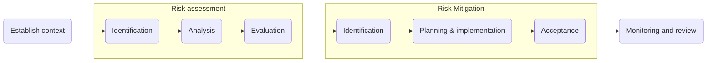

## Background

To be read in conjunction with the [risk-management-policy].

## Objectives

- Outline the risk assessment and mitigation procedure

## Scope

All risk management activities on managed artifacts.

## Definitions

See [risk-management-policy].

## Flow chart

## Procedure

#### When to do risk management

**Software**

It can be done throughout the software development lifecycle (SDLC), though often it's done during the design and planning phases. Often assessments are updated as software moves through the cycle and knowledge changes (see [software-development-lifecycle-policy]).

At the very least, an assessment should be performed and reviewed prior to a software release being deployed to production.

**Everything else**

It will also be necessary to risk assess things other than software e.g. business continuity during a pandemic. These assessments can be performed ad hoc as required.

#### Establish context

Check the [isms-requirements-record] to make sure you understand our key stakeholders and their security requirements.
- If you're assessing software that will be released and deployed to customers, the artifact you'll be focused on protecting is customer data.

If you haven't done a risk assessment in a while, check [risk-management-policy/#Definitions] as a refresher.

#### Risk assessment

Use the [risk-register] to record outputs.

Identify *Medium* or *High* risks only, don't worry about *Low* risks.

Use the example risks in the [risk-register] to help you identify relevant types of risk.

To add a risk, complete all the fields in the [risk-register], including `threat`, `vulnerability`, `artifact` and `consequence`.

<InfoMessage header="What's the right number of risks?" content="There is no correct answer this. Just be careful to strike a balance between too few - which can expose you to unmanaged threats and vulnerabilities - and too many - which can create maintenance problems.">

Estimate the impact of the risk if it were to occur. Generally the more valuable the artifact under threat, the higher the impact.

<InfoMessage header="Pro tip" content="Consider confidentiality, integrity and availability impacts. However, you need only record the highest impact for C, I or A.">

Assign a likelihood level based on known evidence and your experience.

Use your risk model to determine the overall risk level.

Determine whether your risks need mitigation using the risk acceptance criteria.

Since you've only considered *Medium* and *High* risks, you'll need to consider mitigation for all of them.

Prioritise your risks for mitigation.

### Risk mitigation

Identify controls capable of reducing risks to a *Low* overall risk level. Focus only on controls that will help you achieve this.

Use the example mitigations in the [risk-register] to identify relevant types of control.

Descriptions of controls need not conform to a standard formulation.

Plan and implement controls as part of the team's regular cycle as outlined in the [software-development-lifecycle-policy].

Repeat risk assessment to estimate residual risk post mitigation.
- If the risk is still not acceptable, go through the loop again.
- If the risk is still not acceptable but further mitigation is not possible or practical, an exception must be given by the Security or Privacy Officers.

### Review and monitoring

After mitigation, discuss with the Security Officer whether creating a metric and monitoring it is necessary.

TODO
