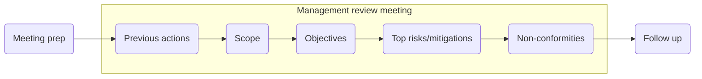

## Background

Management review of the information security management system (ISMS) helps us assess its effectiveness.

## Objectives

- Define a procedure for preparing for, conducting and following up after management reviews of the isms.

## Scope

The ISMS.

## Definitions

- **ISMS effectiveness** - achieves the organisation's security objectives

## Flow chart

### Meeting preparation

The meeting should be convened quarterly and include, at a minimum:
- Top level management (including the CEO and CTO)
- Compliance Officer
- Security Officer
- Privacy Officer
- Appropriate delegates

The following documents should be available for review during the meeting:
- Statement of applicability
- Context of the organisation documentation
- [information-security-policy]
- Audit reports
- Minutes from previous meetings (see [meeting-minutes])
- Issue resolution reports
- Monitoring data

### Meeting

#### Open meeting

Nominate someone to take minutes:
- Minutes should include a record of all actions and their owners.

Introduce attendees.

Introduce meeting objectives.

#### Review actions from previous review

Review the status of all actions from the previous review.

#### Review scope

Discuss changes in the operating environment related to security.

Review the impact these changes have on:
- Interested parties
- Regulatory, contractual and/or legal requirements
- Healthforge's commercial interests.

#### Review objectives

Review security objectives.
- Are they still relevant?
- If not, record follow up actions.

Review effectiveness of the ISMS.
- Review security objectives and metrics
- Present values for metrics, analysis and evaluation for management review (Compliance Officer).

#### Review top risks and mitigations

Review top risks.

Review mitigations:
- Review status of mitigations
- Agree residual risk is acceptable
- Agree action for follow up, if required
- Discuss and approve any additional resources required.

#### Review non-conformities

Review non-conformities from audits since last review.

Review corrective actions and status.

#### Any other business

Further agenda items may also include the following:
- Feedback from interested parties (e.g. customers, end users, suppliers, staff)
- Further opportunities for improving the ISMS
- Changes to team composition/size
  - If the senior to junior employee ratio exceeds 1:2 a review of the risk register is triggered
  - If the C-level team composition/size changes in any way, a review of the risk register is triggered.

#### Close meeting

Review all actions and assign to owners.

Agree date for next meeting.

### Follow up

Meeting minutes to be written up and circulated to attendees for approval and sign-off.

Appropriate attendee(s) to coordinate actions recorded.

Privacy Officer to communicate any changes or pertinent details to company.
